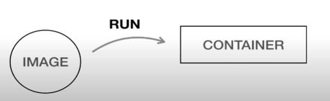
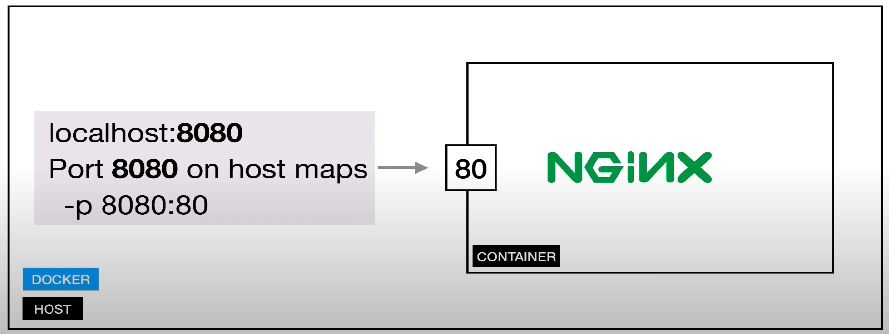
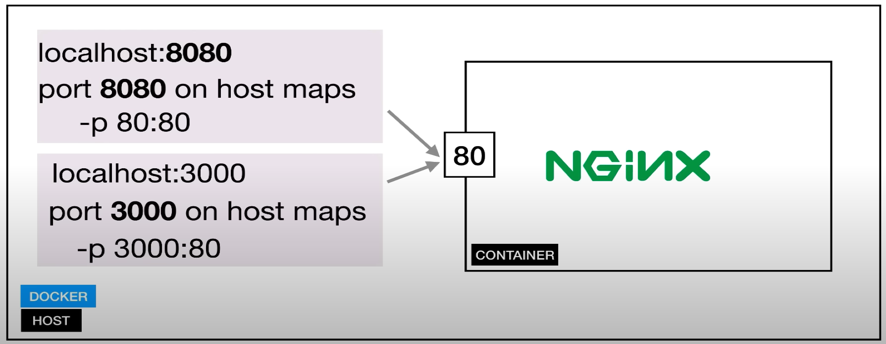
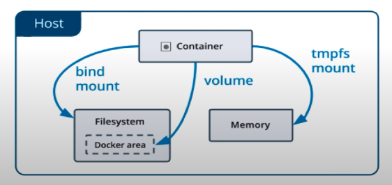
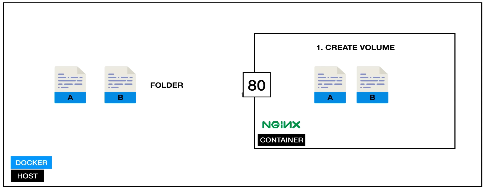
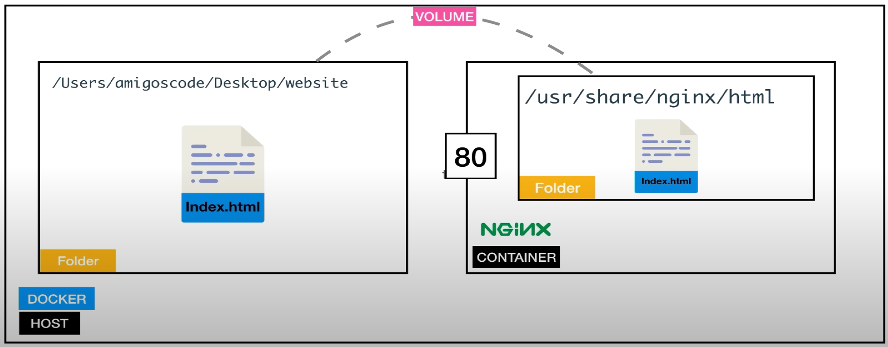
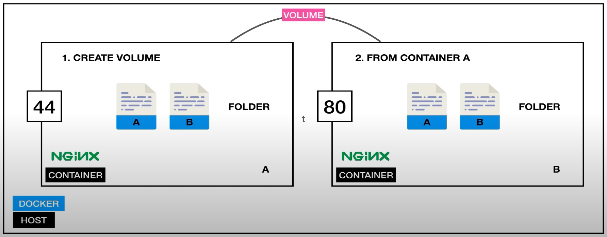
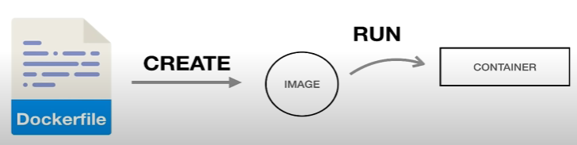
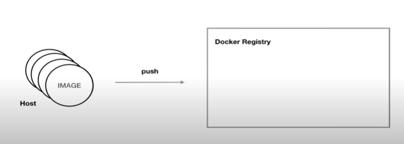

# DOCKER

## What is Docker?
- Docker is a tool for running applications in an isolated environment.
- Similar to a Virtual Machine.
- App runs in same environment.
- Standard for software deployment.

## Container vs Virtual Machine

- ### Containers
    Containers are an abstraction at the app layer that packages code and dependencies together. Multiple containers can run on the same machine and share thr OS kernel with other containers, each running as isolated processes in user space.

- ### Virtual Machine
    VMs are an abstraction of phusical hardware turning one server into many servers. The **hypervisor** allows multiple VMs to run on a single machine. Each VM includes a full copy of an operating system, the application, necessary binaries and libraries - taking up tens of GBs. VMs can also be slow to boot.


## Benefits
- Running containers takes seconds instead of minutes.
- Less resources results in less disk space needed.
- Less Memory.
- Does not need full OS.
- Deployment
- Testing

## Docker Image
- Image is a template for creating an environment of your choice. This can be a database, web application.
- An Image is also an Snapshot (Snapshots are multiple version of image. We can point to any version we want at a particular time).
- It contains everything an app needs to run (OS, Software, App Code) .

## Container
- Running instance of an Image.  


## Exposing Port
Mapping port 8080 to port 80 running on the container  
`docker run -d -p 8080:80 nginx:latest`



## Exposing Multiple Ports
`docker run -d -p 3000:80 -p 8080:80 nginx:latest`




## Volumes
- Allows sharing of data. Files & Folders.
- Between host and container.
- Between containers.



- ### Host & Container:


    `docker run --name some-nginx -v /some/content:/usr/share/nginx/html:ro -d nginx`

    where,
        - -v: volume
        - ro: read only
        - remove ro to enter write mode.

- ### Between Host & Container



    - changes are reflected immediately in container.

- ### Between Containers

Can be done using `--volumes-from` flag.

  

`docker run --name website-copy --volumes-from website -d -p 8081:80 nginx`

#### How do I copy particular folders from one container to another?


## Dockerfile
- Build own images



- Basic Image:
    - Dockerfile:
        ```# base image
        FROM nginx:latest

        # add content inside the container
        # ADD {from} {destination}
        ADD . /usr/share/nginx/html
        ```

    - run:
        `docker build --tag website:latest .`

        where,   
            1. website: name of container  
            2. latest: tag  
            3. {.}: location of docker file.

***
## NOTE:

- You cannot remove a running container. (use -f flag)

## Caching & Layering

### It is important to remember that once there is a change in any step described in Dockerfile, the caching will stop and each and every step will be run again (layered).

Old Dockerfile:
```javascript
FROM node:latest
WORKDIR /app
ADD . /app/
RUN npm install
CMD node index.js
```

Using caching since, we don't need to run `npm install` everytime there's any changes made to the app code. So we check for any changes in `package*.json`. If there are any changes, then the caching will not work.

New Dockerfile:
```javascript
FROM node:latest
WORKDIR /app
ADD package*.json ./
RUN npm install
ADD . /app/ (or `ADD . .` since WORKDIR already entered the `/app`)
CMD node index.js
```

## Alphine
Used to reduce image size.

`docker pull <image_name>:lts-alpine`

Custom Dockerfile
```javascript
FROM node:alpine
WORKDIR /app
ADD package*.json ./
RUN npm install
ADD . /app/
CMD node index.js
```

## Tags & Versions

- Allows to control image version.
- Avoids breaking changes.
- Safe

```javascript
FROM node:10.16.1-alpine
WORKDIR /app
ADD package*.json ./
RUN npm install
ADD . /app/
CMD node index.js
```

### Taggin Own Images

`docker tag user-service-api:latest user-service-api:v1.0 `

`docker tag <from> <to>`

**NOTE:** latest will always point to the latest version.

## Docker Registries
- Highly scalable server side application that stores and lets you distribute Docker images.
- Used in your CD/CI Pipeline.
- Run you applications



There are two types of registries:
- Private
- Public

Most popular Providers:
- Docker Hub
- quay.io
- Amazon EC2

## Pushing Images to Docker Hub


## Commands

- docker version  
`docker --version`

- To pull an image  
`docker pull image_name`

- To list images available locally  
`docker images`

- To run container for an image  
`docker run image_name:tag`

- To run container in a detached mode  
`docker run -d image_name:tag`

- To see containers  
`docker container ls`

- To list the containers that are running on your host  
`docker ps`

- To list all the containers  
`docker ps -a`

- To stop a container  
`docker stop container_id/container_name`

- To start a same container  
`docker start container_name`

- To delete a container  
`docker rm container_id/container_name`

- To delete all the containers  
`docker rm $(docker ps -aq)`

- To forcefully remove a container  
`docker rm -f container_id/container_name`

- To remove image
`docker rmi <image_name>:<tag>`

- To give a name to a container  
`docker run --name website -d -p 3000:80 -p 8080:80 nginx:latest`

- To format ps  
`docker ps --format="ID\t{{.ID}}\nNAME\t{{.Names}}\nIMAGE\t{{.Image}}\nPORTS\t{{.Ports}}\nCOMMAND\t{{.Command}}\nCREATED\t{{.CreatedAt}}\nSTATUS\t{{.Status}}\n"`

- To enter interative mode inside container and execute a bash command.  
`docker exec -it website bash`

- To inspect an image
`docker inspect <image>`

- To see logs of image
`docker logs <image>`

- For logs follow-up
`dockers logs -f <image>`